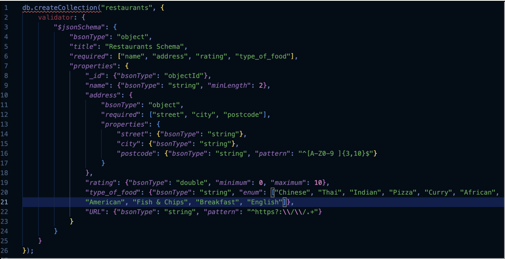
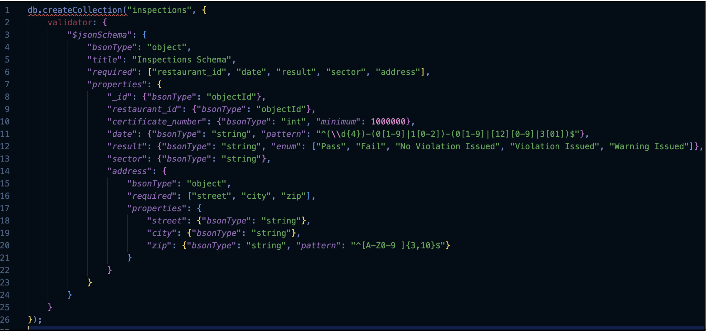
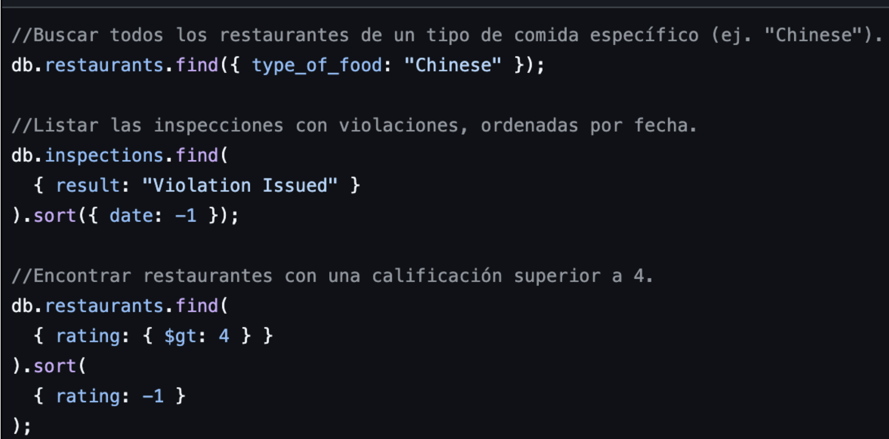
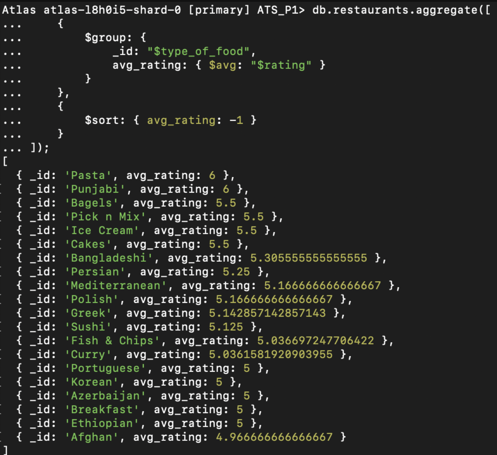
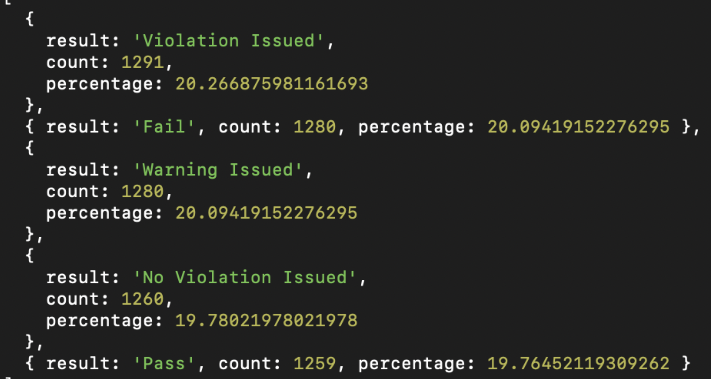
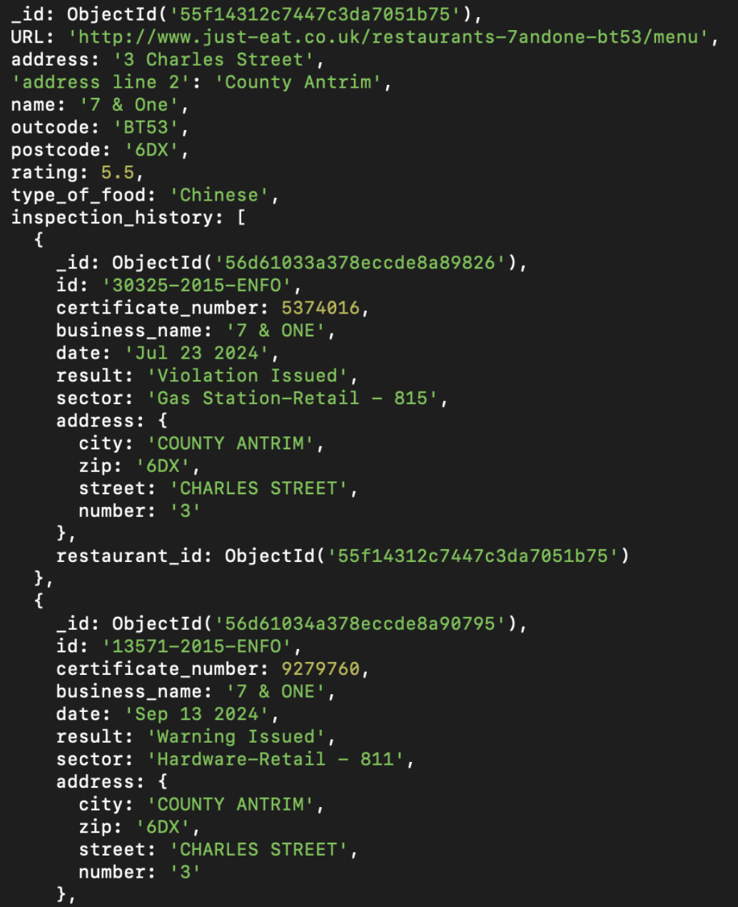
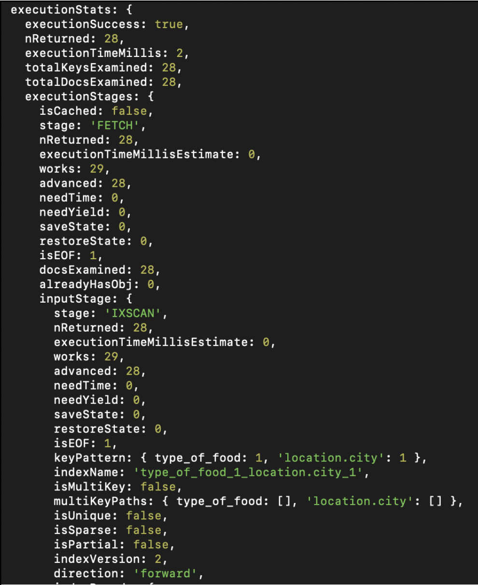
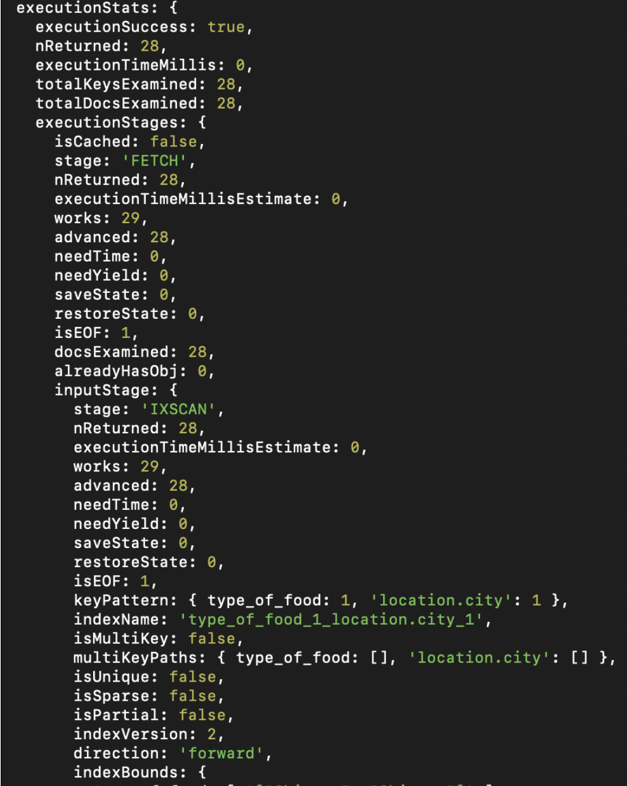

# PRAC1 ATS

## Autores
**Arnau Antúnez** | 1638944  
**Juan Blancas** | 1639220  

## Informe ATS

### Caso de Uso: Plataforma de Restaurantes y Salud Pública
Para justificar las decisiones de diseño en la práctica, se ha definido un caso de uso realista basado en la necesidad de los usuarios de encontrar restaurantes con información relevante sobre su calificación e inspecciones sanitarias. En este escenario, una plataforma permite a los usuarios:

- Buscar restaurantes en su ciudad filtrando por tipo de comida.
- Consultar la calificación media de los restaurantes para tomar decisiones informadas.
- Ver el historial de inspecciones sanitarias de cada restaurante y comprobar que cumple con la normativa vigente.

## 1. Tareas Obligatorias
### 1.1. Diseño del esquema de la base de datos
#### a) Entidades principales
Los datos que tenemos en los JSON corresponden a dos entidades principales:

- **restaurants**: Contiene información general de los restaurantes.
- **inspections**: Contiene las inspecciones sanitarias realizadas a los restaurantes.

Un restaurante puede estar vinculado a múltiples inspecciones, pero cada inspección pertenece a un solo restaurante, por lo tanto, es una relación **One-to-Many**.

#### b) Uso de referencias en lugar de documentos embebidos
Ventajas:

1. **Escalabilidad**: Si cada restaurante tuviera muchas inspecciones, el documento embebido podría crecer demasiado. En MongoDB hay un límite de 16 MB por documento.
2. **Consultas eficientes**: Con el uso de referencias, podemos buscar inspecciones sin cargar datos del restaurante completo.
3. **Facilidad de actualización**: Si una inspección cambia, se puede modificar sin afectar el documento del restaurante.

#### c) Esquema de validación
- La dirección se ha estructurado como un subdocumento con campos específicos (`street`, `city`, `postcode`).
- Se han impuesto límites en la calificación (0 a 10) y en el código postal.
- Validación de URL para asegurar que tenga el prefijo `http://` o `https://`.
- Restricciones en `inspections.json`:
  - Fecha obligatoria en formato `YYYY-MM-DD`.
  - Clasificación del resultado en valores predefinidos (`Pass`, `Fail`, `Violation Issued`, etc.).
  - Estructura de dirección similar a la de los restaurantes para coherencia.

  
<p align="center"><strong><em>Figura 1.</em></strong></p>

  
<p align="center"><strong><em>Figura 2.</em></strong></p>

### 1.2. Implementación de consultas en MongoDB
Ejemplos de consultas implementadas:

- Buscar todos los restaurantes de un tipo de comida específico (ej. "Chinese").
- Listar las inspecciones con violaciones, ordenadas por fecha.
- Encontrar restaurantes con una calificación superior a 4.

  
<p align="center"><strong><em>Figura 3.</em></strong></p>

El código de estas consultas se encuentra en el archivo `consultas.js` dentro de la carpeta `scripts` del repositorio de GitHub.

### 1.3. Uso de agregaciones
Consultas implementadas con agregaciones:

- Agrupar restaurantes por tipo de comida y calcular la calificación promedio.

  
<p align="center"><strong><em>Figura 4.</em></strong></p>

- Contar el número de inspecciones por resultado y mostrar los porcentajes.

  
<p align="center"><strong><em>Figura 5.</em></strong></p>

- Unir restaurantes con sus inspecciones utilizando `$lookup`.

  
<p align="center"><strong><em>Figura 6.</em></strong></p>

## 2. Tareas Avanzadas
### 2.1. Optimización del rendimiento
Consultas más frecuentes:

| Consulta | Explicación |
|----------|------------|
| Buscar restaurantes por tipo de comida y/o ciudad | Para que los usuarios encuentren restaurantes de un tipo específico en su ubicación. |
| Ordenar restaurantes por calificación | Mostrar los mejores restaurantes primero. |
| Buscar inspecciones con violaciones sanitarias | Permite a los usuarios ver si un restaurante ha suspendido inspecciones antes de decidir visitarlo. |

Índices creados para mejorar el rendimiento:

```javascript
 db.restaurants_summary.createIndex({ type_of_food: 1, "location.city": 1 });
 db.restaurants_summary.createIndex({ rating: -1 });
 db.restaurants_summary.createIndex({ "latest_inspection.result": 1 });
```

Antes de los índices, las consultas tardaban 2ms, después de optimizarlas tardan 0ms.

  
<p align="center"><strong><em>Figura 7.</em></strong></p>

  
<p align="center"><strong><em>Figura 8.</em></strong></p>

### 2.2. Estrategias de escalabilidad
#### a) **Sharding**
Distribución de datos en varios servidores para evitar sobrecarga. Se seleccionó `location.city` con un índice `hashed` ya que la mayoría de las consultas filtran restaurantes por ciudad.

#### b) **Replicación**
Configuración del **Replica Set** con tres nodos:

- **Primary Node**: Maneja todas las operaciones de escritura y lectura.
- **Secondary Nodes**: Mantienen copias actualizadas de los datos y responden a consultas de solo lectura.
- **Arbiter**: No almacena datos, pero participa en la elección de un nuevo Primary en caso de fallo.

### Desafíos y soluciones

1. **Carga desigual entre shards**
   - **Problema**: Algunas ciudades pueden tener más consultas que otras.
   - **Solución**: Uso de **Zonas de Sharding** para asignar shards específicos a ciertas regiones.

2. **Sobrecarga en las operaciones de escritura**
   - **Problema**: Escrituras masivas pueden generar sobrecarga en el sistema.
   - **Solución**: Aplicar escrituras limitadas por una ventana de "x" escrituras, para procesarlas en lotes controlados.

---
Este informe describe las estrategias de diseño, consultas y escalabilidad implementadas para optimizar la base de datos en una plataforma de restaurantes y salud pública.
